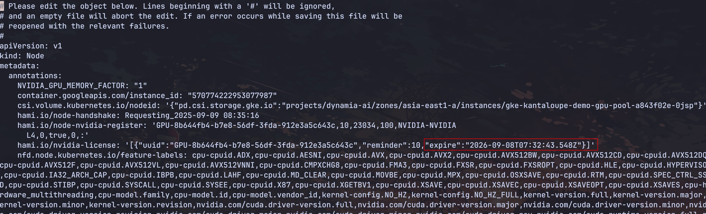

1. 怎么查看当前 HAMi 是否导入 license？

可以通过节点 annotation 来查看，会标记每一个设备的过期时间。

2. 为什么 pod 一直 pengding，查看日志显示 5 分钟节点锁自动释放？

hami-scheduler 在调度的时候会将调度的节点 gpu 资源锁住，当 device-plugin 将 pod 运行以后会自动释放锁，如果 device-plugin 给 pod 分配 gpu 资源失败，会在 5 分钟后自动释放锁。

3. 为什么我无法在同一张卡上分配两个 vGPU，尽管看到 10 个 vGPU？

vGPU 是使用虚拟化创建的物理 GPU 的逻辑实例，允许多个任务共享同一个物理 GPU。例如，设置 deviceSplitCount： 10 意味着物理 GPU 最多可以为 10 个任务分配资源。此分配不会增加物理资源; 它仅定义逻辑可见性。但不允许单个任务使用来自同一 GPU 的多个 vGPU。

4. HAMi 的 nvidia.com/priority 字段仅支持两个级别。我们如何为作业队列实现多级、用户定义的基于优先级的调度，尤其是在集群资源有限的情况下？

HAMi 内置的两级优先级用于单个 GPU 上的运行时抢占（例如，紧急任务暂停同一卡上不太重要的任务）。HAMi 暂不支持多级队列优先级以进行作业分配和抢占。

5. 为什么我的 Pod 输出中有 [HAMI-core Warn（...）] 日志？我可以禁用它们吗？

这是正常现象，可以忽略不计。如果需要，通过在容器中设置环境变量 LIBCUDA_LOG_LEVEL=0 来禁用日志。

6. HAMi 是否支持多节点、多 GPU 分布式训练？是否支持跨主机、跨 GPU 场景？

HAMi 通过在不同节点上调度多个 Pod 并利用分布式框架进行跨主机和跨 GPU 协作，支持多节点、多 GPU 分布式训练。单个 Pod 支持同一节点上的多个 GPU。

7. 为什么节点容量和可分配对象仅显示 nvidia.com/gpu，而不显示 nvidia.com/gpucores 或 nvidia.com/gpumem？

设备插件只能报告单个资源类型。GPU 内存和算力信息存储在节点的 annotation 中，供调度器使用。

8. 为什么一些国内厂商不需要运行时进行安装？

某些国内供应商（例如 Hygon、Cambricon）不需要运行时，因为他们的 DevicePlugin 直接处理设备发现和挂载。相比之下，NVIDIA 和 Ascend 等供应商依赖运行时进行环境配置、设备节点挂载和高级功能支持。
