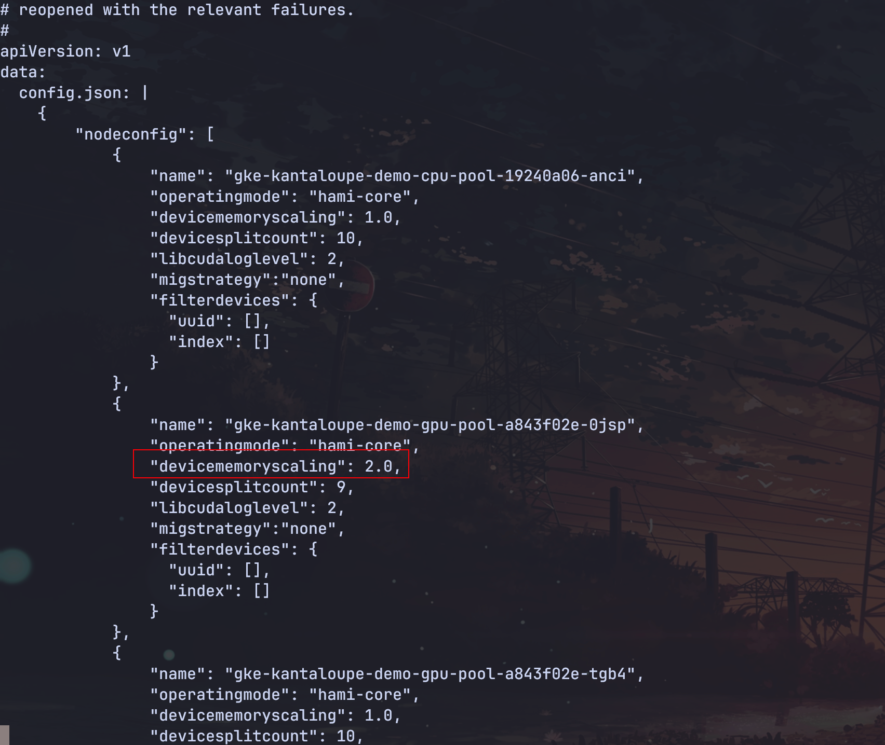

HAMi 支持显存超配，将长时间不用的任务的显存换到主机内存中，节省更多的显存空间来运行更多的任务。适合潮汐模式的在离线混部场景。

1. 开启显存超配：

修改 device-plugin 的 configmap，将节点的显存超配的比例设置为 2 倍。

```yaml
kubectl edit configmap -n hami-system hami-device-plugin
```




2. 分配 1.2 倍的显存给工作负载，请看[示例](./sources/memory-override.yaml)

```yaml
apiVersion: apps/v1
kind: Deployment
metadata:
  name: memory-override
spec:
  replicas: 2
  selector:
    matchLabels:
      app-name: memory-override
  template:
    metadata:
      annotations:
        nvidia.com/use-gpuuuid: GPU-8b644fb4-b7e8-56df-3fda-912e3a5c643c
      labels:
        app-name: memory-override
    spec:
      containers:
      - args:
        - sleep infinity
        command:
        - /bin/bash
        - -c
        image: ubuntu:latest
        name: main
        resources:
          limits:
            nvidia.com/gpu: "1"
            nvidia.com/gpucores: "10"
            nvidia.com/gpumem: "1240"
```
