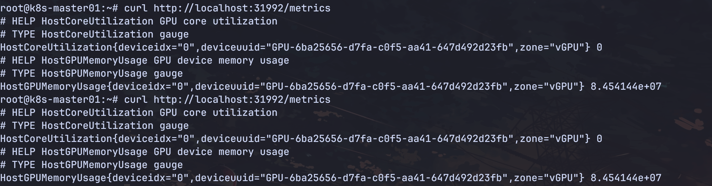
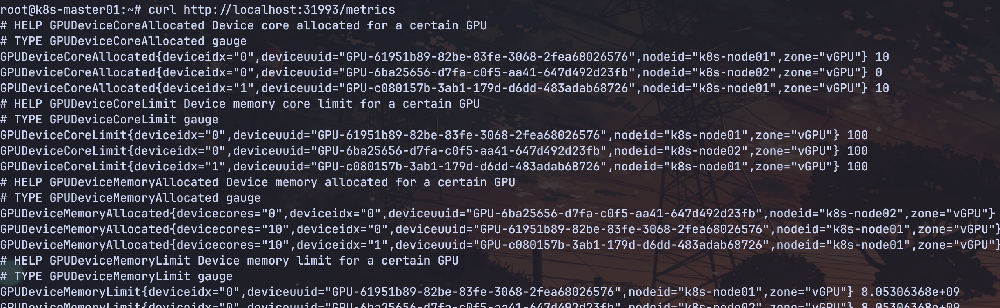
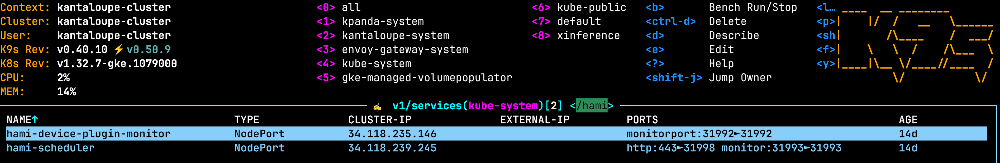

HAMi 提供了 hami-schduler 和 device-plugin 的指标。通过 31992 和 31993 端口暴露指标：

1. 访问 hami-scheduler 的指标：

```bash
curl http://localhost:31992/metrics
```




2. 访问 device-plugin 的指标：

```bash
curl http://localhost:31993/metrics
```




3. HAMi monitor service 服务



metrics 详情请参考 HAMi Monitor。

1. https://project-hami.io/docs/userguide/monitoring/device-allocation
2. https://project-hami.io/docs/userguide/monitoring/real-time-device-usage
