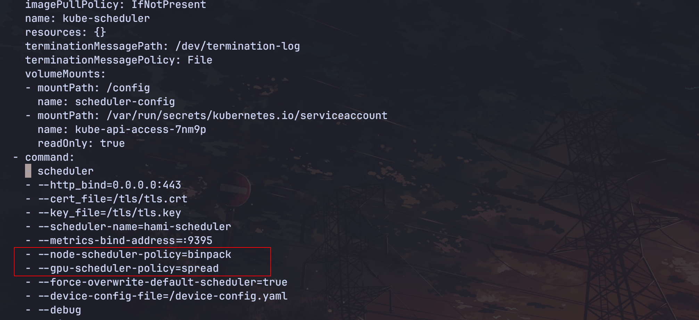

HAMi 主要有两个配置文件，之前的 lab 中也修改过 device-plugin 的配置，下面我们介绍两个配置文件主要的参数。

1. device-plugin 的配置：

```bash
kubectl get config -n hami-system hami-device-plugin -oyaml
```

* nvidia.deviceMemoryScaling: 显存超配率
* nvidia.deviceSplitCount: 整卡切分的数量
* nvidia.defaultMem: 默认任务的显存大小 
* nvidia.defaultCores: 默认任务的算力带下
* nvidia.defaultGPUNum: 默认任务 GPU 设备数量

2. scheudler 的配置

通过修改 hami-scheduler deployment 的 args：

```bash
kubectl edit deployment -n hami-system hami-scheduler
```



```yaml
...
- command:
  - scheduler
  - --http_bind=0.0.0.0:443
  - --cert_file=/tls/tls.crt
  - --key_file=/tls/tls.key
  - --scheduler-name=hami-scheduler
  - --metrics-bind-address=:9395
  - --node-scheduler-policy=binpack
  - --gpu-scheduler-policy=spread
  - --force-overwrite-default-scheduler=true
  - --device-config-file=/device-config.yaml
  - --debug
  - -v=4
...
```

* --node-scheduler-policy: 指定节点级别的调度策略。
* --gpu-scheduler-policy: 指定设备级别的调度策略。

也可以在 helm 安装指定:

```bash
helm install hami hami-charts/hami --set devicePlugin.deviceMemoryScaling=5 ...
```

* scheduler.defaultSchedulerPolicy.nodeSchedulerPolicy：默认节点的调度策略，`binpack` 或者 `spread`。
* scheduler.defaultSchedulerPolicy.gpuSchedulerPolicy：默认卡的调度策略，`binpack` 或者 `spread`。

更多的配置文件详情请参考：https://project-hami.io/docs/userguide/configure
