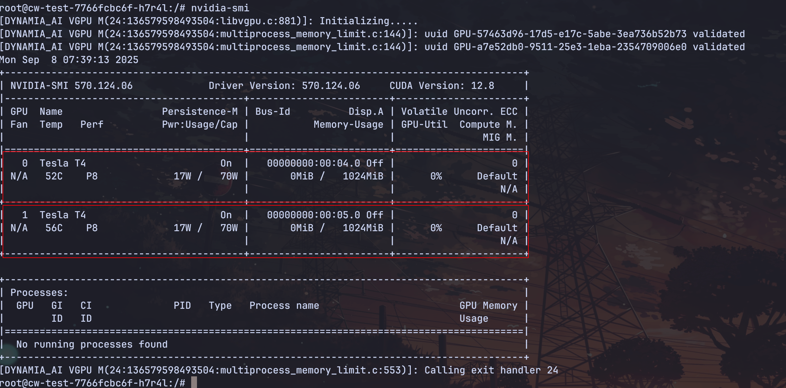

在准备工作完成以后，我们使用 HAMi 的显存和算力切分功能来创建一个工作负载。请看下面[示例](./sources/gpu-shared.yaml)：

```yaml
apiVersion: v1
kind: Pod
metadata:
  name: gpu-shared
spec:
  containers:
  - args:
    - sleep infinity
    command:
    - /bin/bash
    - -c
    image: ubuntu:latest
    imagePullPolicy: IfNotPresent
    name: gpu-shared
    resources:
      limits:
        nvidia.com/gpu: "2"
        nvidia.com/gpucores: "70"
        nvidia.com/gpumem: "1024"
        # nvidia.com/gpumem-percentage: 50
```

* `nvidia.com/gpu`：申请 GPU 设备的个数
* `nvidia.com/gpumem`：申请显存的大小，单位为 M
* `nvidia.com/gpucores`：申请算力大小，最小粒度为百分之一
* `nvidia.com/gpumem-percentage`：显存百分比，和 `nvidia.com/gpumem` 都能申请显存，不能同时存在。

创建上面的工作负载，等待 HAMi 调度完成以后，进入到容器中，我们可以通过 `nvidia-smi` 命令来检查当前环境是否跟申请的资源一致。


