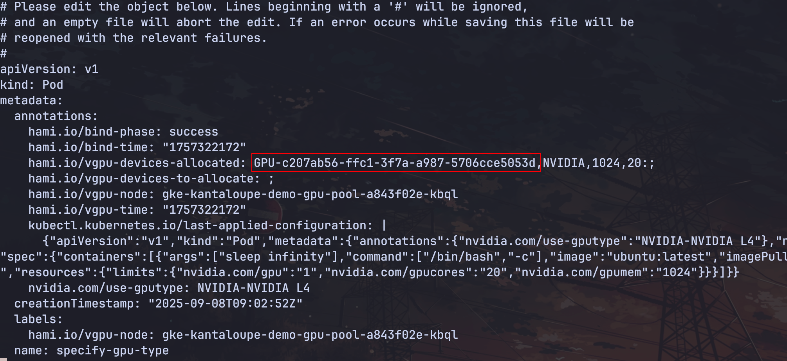

有的时候任务希望在特定类型的 GPU 设备上运行，HAMi 提供了指定 GPU 设备类型进行调度的功能。可以在 pod 的 annotation 指定 `nvidia.com/use-gputype` 和 `nvidia.com/use-gputype` 来指定 GPU 的类型和不使用 GPU 的类型。

1. 指定 `NVIDIA-NVIDIA L4` 来调度工作负载，请看[示例](./sources/use-gpu-type.yaml)

```yaml
apiVersion: v1
kind: Pod
metadata:
  annotations:
    nvidia.com/use-gputype: "NVIDIA-NVIDIA L4"
  name: use-gpu-type
spec:
  containers:
  - args:
    - sleep infinity
    command:
    - /bin/bash
    - -c
    image: ubuntu:latest
    imagePullPolicy: IfNotPresent
    name: use-gpu-type
    resources:
      limits:
        nvidia.com/gpu: "1"
        nvidia.com/gpucores: "20"
        nvidia.com/gpumem: "1024"
```

创建完工作负载以后，我们查看 pod 的信息是否与节点上的 HAMi 注册的设备信息是否一致。

pod 信息：


设备信息：


2. 指定工作负载不调度到 `NVIDIA-NVIDIA L4` 类型的设备，请看[示例](./sources/nouse-gpu-type.yaml):

```yaml
apiVersion: v1
kind: Pod
metadata:
  annotations:
    nvidia.com/nouse-gputype: "NVIDIA-NVIDIA L4"
  name: nouse-gpu-type
spec:
  containers:
  - args:
    - sleep infinity
    command:
    - /bin/bash
    - -c
    image: ubuntu:latest
    imagePullPolicy: IfNotPresent
    name: nouse-gpu-type
    resources:
      limits:
        nvidia.com/gpu: "1"
        nvidia.com/gpucores: "20"
        nvidia.com/gpumem: "1024"
```

创建完工作负载以后，检查工作负载所在的设备是否调度在 "NVIDIA-NVIDIA L4" 上，如果没有则说明符合调度策略。

pod 信息：


设备信息：


HAMi 除了提供指定卡类型的调度策略，还提供了粒度更小的方式来指定设备。通过 `nvidia.com/use-gpuuuid` 和 `nvidia.com/nouse-gpuuuid` 指定设备的唯一标识调度和排除指定设备。


3. 指定设备 ID 调度，请看[示例](./sources/use-gpu-uuid.yaml):

```yaml
apiVersion: v1
kind: Pod
metadata:
  annotations:
    nvidia.com/use-gpuuuid: "GPU-57463d96-17d5-e17c-5abe-3ea736b52b73"
  name: use-gpu-uuid
spec:
  containers:
  - args:
    - sleep infinity
    command:
    - /bin/bash
    - -c
    image: ubuntu:latest
    imagePullPolicy: IfNotPresent
    name: use-gpu-uuid
    resources:
      limits:
        nvidia.com/gpu: "1"
        nvidia.com/gpucores: "20"
        nvidia.com/gpumem: "1024"
```

查看 pod 的调度信息与指定的 ID 一致：


4. 指定设备 ID 不调度，请看[示例](./sources/nouse-gpu-uuid.yaml):

```yaml
apiVersion: v1
kind: Pod
metadata:
  annotations:
    nvidia.com/nouse-gpuuuid: "GPU-57463d96-17d5-e17c-5abe-3ea736b52b73"
  name: nouse-gpu-uuid
spec:
  containers:
  - args:
    - sleep infinity
    command:
    - /bin/bash
    - -c
    image: ubuntu:latest
    imagePullPolicy: IfNotPresent
    name: nouse-gpu-uuid
    resources:
      limits:
        nvidia.com/gpu: "1"
        nvidia.com/gpucores: "20"
        nvidia.com/gpumem: "1024"
```

查看 pod 的调度信息调度到其他的设备上：


