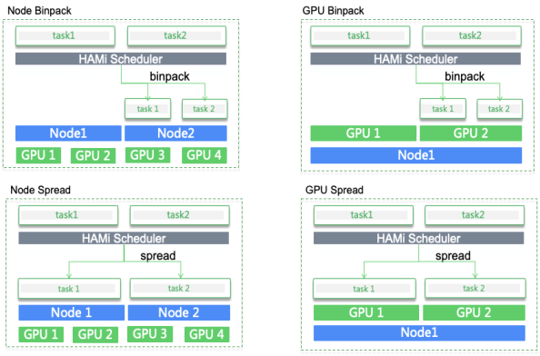
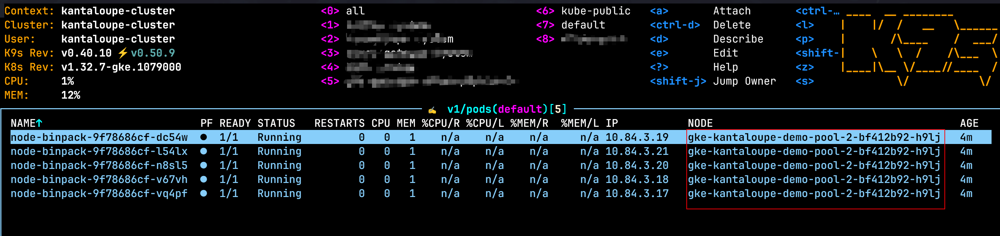
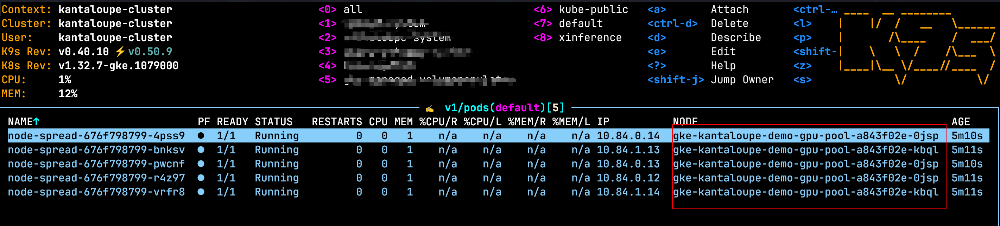
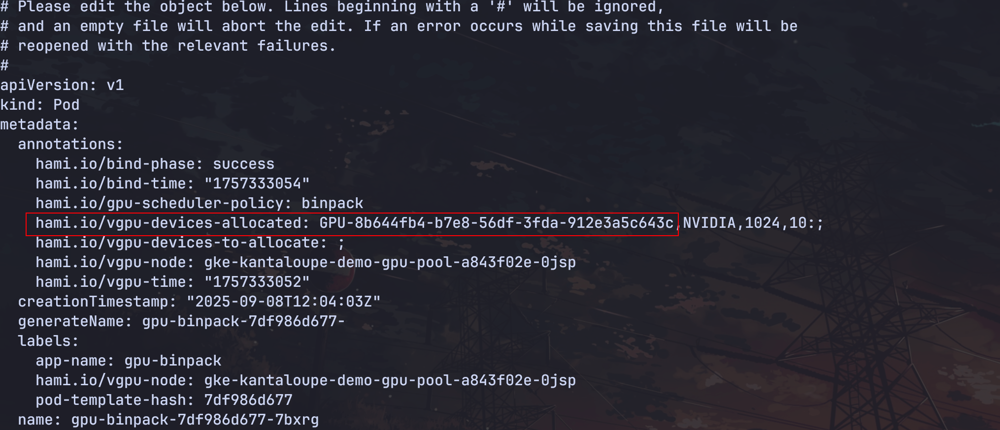
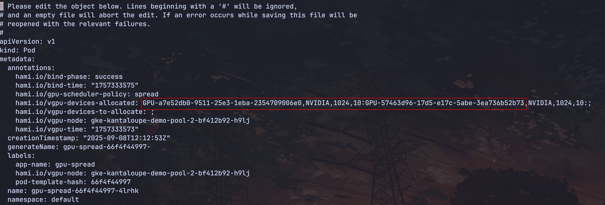
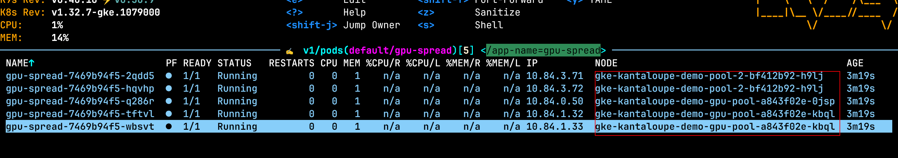

`binpack` 和 `spread` 是两种截然不同的调度策略。`binpack` 是尽量将所有的工作负载都调度到同一个节点或者同一张设备上，避免饿死小的任务，而 `spread` 是尽量将工作负载均衡的分配到不同的节点或者不同的设备上。




HAMi 即提供了基于节点的 `binpack` 和 `spread` 的调度策略，也提供了基于设备的调度策略。通过在 annotation 中设置 `hami.io/node-scheduler-policy` 和 `hami.io/gpu-scheduler-policy` 来指定。

1. 节点 `binpack` 调度策略，请看[示例](./sources/node-binpack.yaml)

```yaml
apiVersion: apps/v1
kind: Deployment
metadata:
  name: node-binpack
spec:
  replicas: 5
  selector:
    matchLabels:
      app-name: node-binpack
  template:
    metadata:
      annotations:
        hami.io/node-scheduler-policy: binpack
      labels:
        app-name: node-binpack
    spec:
      containers:
      - args:
        - sleep infinity
        command:
        - /bin/bash
        - -c
        image: ubuntu:latest
        name: main
        resources:
          limits:
            nvidia.com/gpu: "1"
            nvidia.com/gpucores: "10"
            nvidia.com/gpumem: "1024"
```

查看调度结果，5 个副本被分配到同一个节点上。




2. 节点 `spread` 调度策略，请看[示例](./sources/node-spread.yaml)：

```yaml
apiVersion: apps/v1
kind: Deployment
metadata:
  name: node-spread
spec:
  replicas: 5
  selector:
    matchLabels:
      app-name: node-spread
  template:
    metadata:
      annotations:
        hami.io/node-scheduler-policy: spread
      labels:
        app-name: node-spread
    spec:
      containers:
      - args:
        - sleep infinity
        command:
        - /bin/bash
        - -c
        image: ubuntu:latest
        name: main
        resources:
          limits:
            nvidia.com/gpu: "1"
            nvidia.com/gpucores: "10"
            nvidia.com/gpumem: "1024"
```

查看调度结果，5 个副本被均衡分配到两个节点上。




3. 卡级别 `binpack` 调度策略，请看示例[](./sources/gpu-binpack.yaml):

```yaml
apiVersion: apps/v1
kind: Deployment
metadata:
  name: gpu-binpack
spec:
  replicas: 5
  selector:
    matchLabels:
      app-name: gpu-binpack
  template:
    metadata:
      annotations:
        hami.io/gpu-scheduler-policy: binpack
      labels:
        app-name: gpu-binpack
    spec:
      containers:
      - args:
        - sleep infinity
        command:
        - /bin/bash
        - -c
        image: ubuntu:latest
        name: main
        resources:
          limits:
            nvidia.com/gpu: "1"
            nvidia.com/gpucores: "10"
            nvidia.com/gpumem: "1024"
```

查看调度结果，5 个副本被调度到同一个设备上。




4. 卡级别 `spread` 调度策略，请看示例[](./sources/gpu-spread.yaml):

```yaml
apiVersion: apps/v1
kind: Deployment
metadata:
  name: gpu-spread
spec:
  replicas: 5
  selector:
    matchLabels:
      app-name: gpu-spread
  template:
    metadata:
      annotations:
        hami.io/gpu-scheduler-policy: spread
      labels:
        app-name: gpu-spread
    spec:
      containers:
      - args:
        - sleep infinity
        command:
        - /bin/bash
        - -c
        image: ubuntu:latest
        name: main
        resources:
          limits:
            nvidia.com/gpu: "1"
            nvidia.com/gpucores: "10"
            nvidia.com/gpumem: "1024"
```

查看调度结果，5 个副本被调度到两个个设备上。




查看结果，pod 被调度到不同的节点和不同的卡：




6. 节点级别和卡级别的 `spread`，请看[示例](./sources/gpu-node-spread.yaml):

```yaml
apiVersion: apps/v1
kind: Deployment
metadata:
  name: gpu-node-spread
spec:
  replicas: 5
  selector:
    matchLabels:
      app-name: gpu-node-spread
  template:
    metadata:
      annotations:
        hami.io/gpu-scheduler-policy: spread
        hami.io/node-scheduler-policy: spread
      labels:
        app-name: gpu-node-spread
    spec:
      containers:
      - args:
        - sleep infinity
        command:
        - /bin/bash
        - -c
        image: ubuntu:latest
        name: main
        resources:
          limits:
            nvidia.com/gpu: "1"
            nvidia.com/gpucores: "10"
            nvidia.com/gpumem: "1024"
```


5. HAMi 节点默认的调度策略是 `binpack`，GPU 的调度策略是 `spread`。可以通过修改启动参数来修改默认的行为：

```yaml
...
- command:
  - scheduler
  - --http_bind=0.0.0.0:443
  - --cert_file=/tls/tls.crt
  - --key_file=/tls/tls.key
  - --scheduler-name=hami-scheduler
  - --metrics-bind-address=:9395
  - --node-scheduler-policy=binpack
  - --gpu-scheduler-policy=spread
  - --force-overwrite-default-scheduler=true
  - --device-config-file=/device-config.yaml
  - --debug
  - -v=4
...
```

* --node-scheduler-policy: 指定节点级别的调度策略。
* --gpu-scheduler-policy: 指定设备级别的调度策略。

