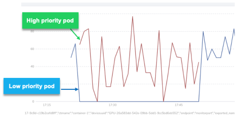

HAMi 支持任务设置不同的优先级（QOS），当 GPU 没有被高优先级任务使用的时候，低优先级就会得到运行，一旦高优先级的任务运行，GPU 算力将得到优先保证，低优先级的任务就会被 hang 住。等高优先级的任务释放，再次得到运行。

在工作负载中添加环境变量 `CUDA_TASK_PRIORITY`，0 代表高优先级，1 代表低优先级，请看[示例](./sources/priority.yaml):

```yaml
apiVersion: v1
kind: Pod
metadata:
  annotations:
  name: priority
spec:
  containers:
  - args:
    - sleep infinity
    command:
    - /bin/bash
    - -c
    env:
      - name: CUDA_TASK_PRIORITY
        value: '0'
    image: ubuntu:latest
    imagePullPolicy: IfNotPresent
    name: high-priority
    resources:
      limits:
        nvidia.com/gpu: "1"
        nvidia.com/gpucores: "10"
        nvidia.com/gpumem: "1024"
  - args:
    - sleep infinity
    command:
    - /bin/bash
    - -c
    env:
      - name: CUDA_TASK_PRIORITY
        value: '1'
    image: ubuntu:latest
    imagePullPolicy: IfNotPresent
    name: low-priority
    resources:
      limits:
        nvidia.com/gpu: "1"
        nvidia.com/gpucores: "10"
        nvidia.com/gpumem: "1024"
```

下面是高优先级和低优先级工作负载运行算力使用的趋势图：


