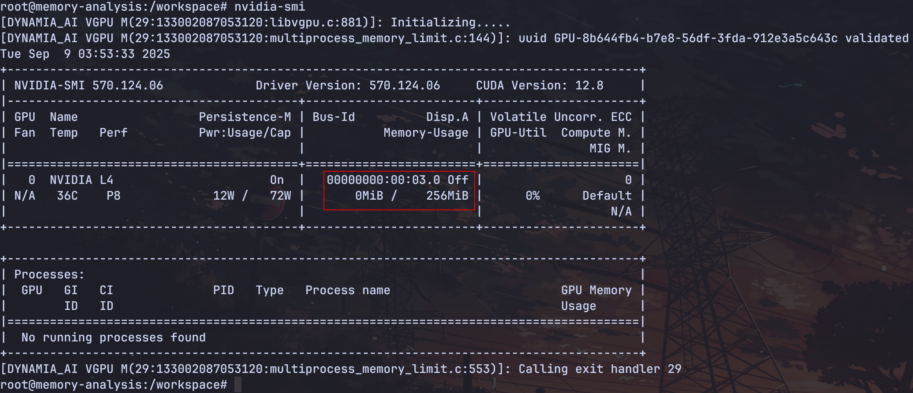
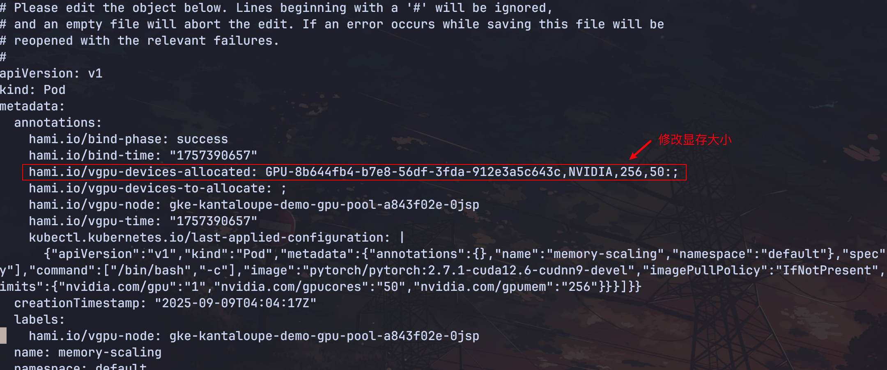
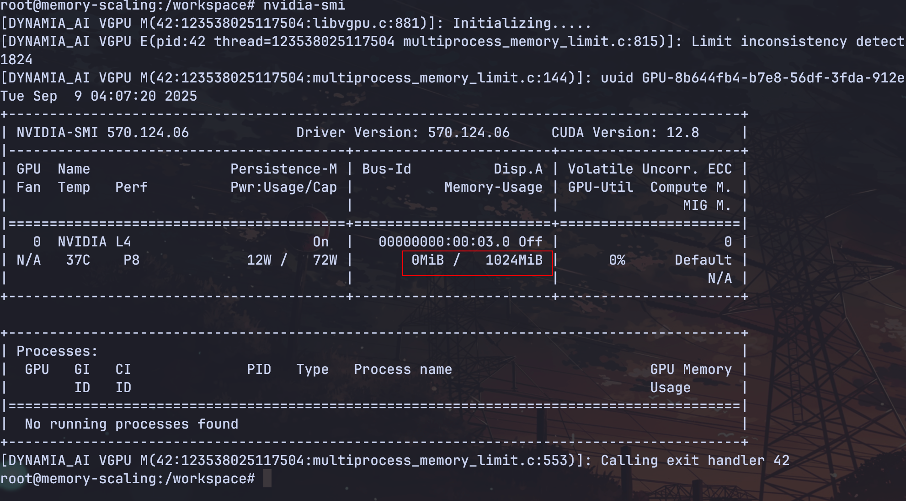
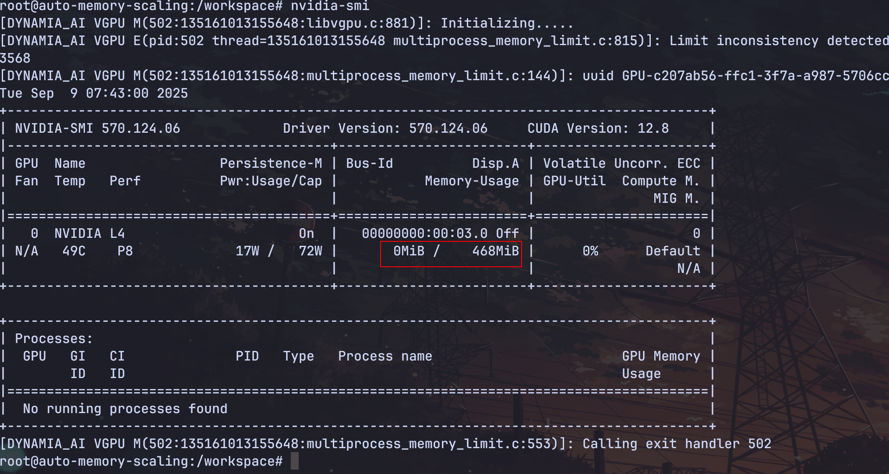

显存自动弹性扩容是一项智能资源管理能力，支持系统根据应用运行过程中的真实显存负载，动态调整分配的 GPU 显存资源，应用无需重启。

HAMi 提供了两种扩容的方式：

1. 手动扩容：

创建一个 pytorch 容器，并分配比较小的显存，请看[示例](./sources/memory-scaling.yaml):

```yaml
apiVersion: v1
kind: Pod
metadata:
  name: memory-scaling
spec:
  containers:
  - args:
    - sleep infinity
    command:
    - /bin/bash
    - -c
    image: pytorch/pytorch:2.7.1-cuda12.6-cudnn9-devel
    imagePullPolicy: IfNotPresent
    name: memory-scaling
    resources:
      limits:
        nvidia.com/gpu: "1"
        nvidia.com/gpucores: "50"
        nvidia.com/gpumem: "256"
```

进入容器查看显存分配：



通过 annotation 手动扩容，修改显存大小为 1024：



进入容器重新查看显存大小：



2. 自动扩容，请看[示例](./sources/memory-scaling01.yaml):

```yaml
apiVersion: v1
kind: Pod
metadata:
  name: auto-memory-scaling
spec:
  containers:
  - args:
    - sleep infinity
    env:
    - name: CUDA_MEMORY_AUTO_ADJUST
      value: "true"
    command:
    - /bin/bash
    - -c
    image: pytorch/pytorch:2.7.1-cuda12.6-cudnn9-devel
    imagePullPolicy: IfNotPresent
    name: auto-memory-scaling
    resources:
      limits:
        nvidia.com/gpu: "1"
        nvidia.com/gpucores: "50"
        nvidia.com/gpumem: "200"
```

进入容器，运行简单的矩阵运算：

```python
import torch
import time

if torch.cuda.is_available():
    device = torch.device("cuda")
    print("The GPU is available, and the calculation will be performed using the GPU.")
else:
    print("The GPU is not available, and the calculation will be carried out using the CPU.")
    device = torch.device("cpu")

matrix_size = 4096

a = torch.randn(matrix_size, matrix_size, device=device)
b = torch.randn(matrix_size, matrix_size, device=device)

try:
    while True:
        c = torch.matmul(a, b)
        torch.cuda.synchronize()
        time.sleep(0.01)
except KeyboardInterrupt:
    print("The program has been stopped.")
```

进入容器重新查看显存大小：


