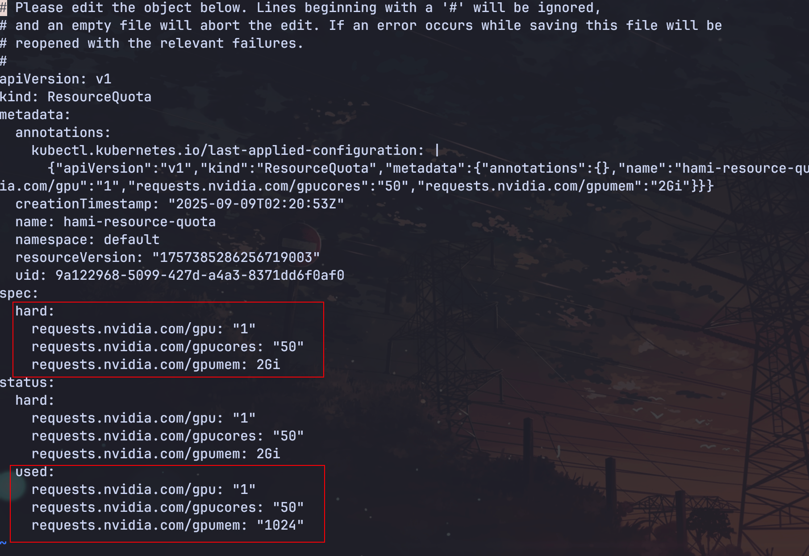

在多租户共享 GPU 的集群的环境下，不同团队或者业务通常运行在各自的命名空间中。如果不限制，某个团队可能会大量占用 GPU 资源，导致其他团队无法获取计算资源，影响整体平台的公共性和稳定性。HAMi 提供了 GPU 配额的功能，名在命令空间层面设置 GPU 配额，明确每个业务能使用的算力和显存总量。

1. 创建 [ResourceQuota](./sources/resource-quota.yaml):

```yaml
apiVersion: v1
kind: ResourceQuota
metadata:
  name: hami-resource-quota
  namespace: default
spec:
  hard:
    requests.nvidia.com/gpu: "1"
    requests.nvidia.com/gpucores: "50"
    requests.nvidia.com/gpumem: "2048"
```

2. 创建一个任务，超过 resource quota 的资源，请看[示例](./sources/resource-quota-pod01.yaml):

```yaml
apiVersion: v1
kind: Pod
metadata:
  name: resource-quota-demo01
spec:
  containers:
  - args:
    - sleep infinity
    command:
    - /bin/bash
    - -c
    image: ubuntu:latest
    imagePullPolicy: IfNotPresent
    name: resource-quota-demo01
    resources:
      limits:
        nvidia.com/gpu: "2"
        nvidia.com/gpucores: "70"
        nvidia.com/gpumem: "1024"
```

请求会被拒绝：

```bash
~ kubectl apply -f sources/resource-quota-pod01.yaml
Error from server (Forbidden): error when creating "sources/resource-quota-pod01.yaml": pods "resource-quota-demo01" is forbidden: exceeded quota: hami-resource-quota, requested: requests.nvidia.com/gpu=2,requests.nvidia.com/gpucores=70, used: requests.nvidia.com/gpu=0,requests.nvidia.com/gpucores=0, limited: requests.nvidia.com/gpu=5,requests.nvidia.com/gpucores=50
```

3. 创建服务 resource quota 的任务，请看[示例](./sources/resource-quota-pod02.yaml):

```yaml
apiVersion: v1
kind: Pod
metadata:
  name: resource-quota-demo02
spec:
  containers:
  - args:
    - sleep infinity
    command:
    - /bin/bash
    - -c
    image: ubuntu:latest
    imagePullPolicy: IfNotPresent
    name: resource-quota-demo02
    resources:
      limits:
        nvidia.com/gpu: "1"
        nvidia.com/gpucores: "50"
        nvidia.com/gpumem: "1024"
```

任务正常 running，查看 resourceQuota 的详情：


