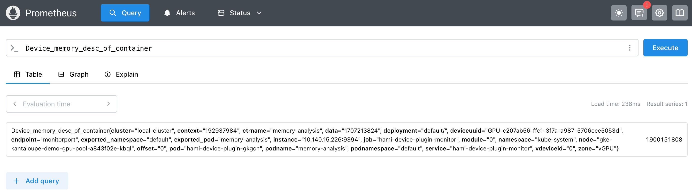

传统模式下，GPU 应用资源占用是一个黑盒，并不能很好的反馈显存的实际占用情况，HAMi 企业版提供应用显存分析的功能。

* context：任务上下文所占显存，包括当前进程执行的独立环境的信息。包括显存信息，调度信息等。
* module：用户在程序中显式分配显存大小。
* data：cuda 编译后的程序（ptx，cubin）加载使用的显存。

1. 运行 pytorch 任务，请看[示例](./sources/memory-analysis.yaml):

```yaml
apiVersion: v1
kind: Pod
metadata:
  name: memory-analysis
spec:
  containers:
  - command:
    - vllm
    - serve
    - Qwen/Qwen3-0.6B
    image: vllm/vllm-openai:v0.10.1
    imagePullPolicy: IfNotPresent
    name: memory-analysis
    resources:
      limits:
        nvidia.com/gpu: "1"
        nvidia.com/gpucores: "50"
        nvidia.com/gpumem: "10240"
```

2. 通过 `Device_memory_desc_of_container{podname=memory-analysis}` 指标查看显存分析：



